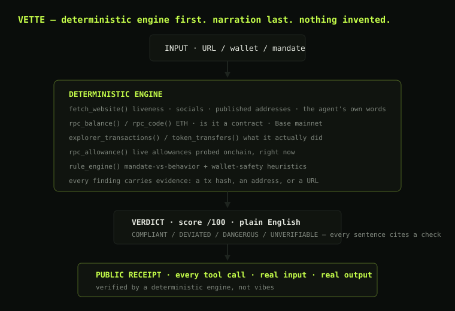

# VETTE 🛡️ — the agent that vets agents

**Every agent makes promises. Vette checks — and when something's wrong, Vette fixes it.**

Vette is an autonomous safety agent for Base, built for the
[Orion Builder Hackathon](https://orionagents.org/hackathon) (deadline Sept 2, 2026, 23:59 UTC).

Live at **https://vette-nu.vercel.app**

## The three moves

1. **AUDIT** 🕵️ — give Vette any agent (website, X, or wallet). It extracts the
   agent's stated mandate from its own copy, pulls its real onchain history from
   Base, and rules on whether behavior matches the promise:
   `COMPLIANT` / `DEVIATED` / `DANGEROUS` / `UNVERIFIABLE` — with a score and a
   public trace of every check behind every claim.
2. **GUARD** 🛡️ — watches a wallet's approval surface and flags what's dangerous.
   *(The Field ships first; live monitoring + GM Report are the next milestones.)*
3. **KILL** ⚡ — connect your wallet, and every dangerous approval becomes a
   one-click revoke: `approve(spender, 0)` signed in your own wallet, confirmed
   live on Base, with the tx hash on screen. Vette doesn't just warn — it acts.

## The Field — every contest entry, under the lens

`/field` pulls the hackathon's public API (each entry's registered wallet,
builder's own words, website, socials) and lets anyone vet the whole field with
one click. Vette's first live catch: a top entry whose published "wallet" is
actually a **token contract**, flagged automatically.

## Architecture — the engine never invents



```
Input (URL / wallet / mandate)
   │
   ▼
DETERMINISTIC ENGINE (always first)
   ├─ website fetch → liveness, socials, published addresses, claimed mandate
   ├─ Base RPC + Blockscout → balances, decoded txs, token transfers,
   │    owner-scoped Approval events, live allowances, contract reputations
   └─ rule engine → mandate-vs-behavior deviation + wallet-safety heuristics
   │
   ▼
VERDICT — score /100 + plain-English narrative. Every sentence cites a check.
   │
   ▼
PUBLIC RECEIPT — every tool call, its real input and output. Nothing invented.
```

Golden rules:
- A finding without a real tx/address/URL behind it is not a Vette finding.
- "Unverifiable" is a valid verdict — Vette never fabricates evidence.
- An empty ledger is UNPROVEN, not compliant.
- A website linking to demo wallets is not declaring those wallets as its own.

## Kill switch safety

- Pure EIP-1193: no keys, no custody — the user signs in their own wallet.
- One transaction type ever: `approve(spender, 0)`. `value` is always 0.
- Preflight `eth_call` simulation before any signature — you never sign a failing tx.
- Only the owner can revoke; auditing someone else's wallet shows why.
- Multi-wallet safe: EIP-6963 discovery with a picker (no more popup wars).

## Run it

```bash
npm install
npm run dev        # http://localhost:3000
```

- Landing: `/` · Audit console: `/audit` · The Field: `/field` · Receipt: `/trace/<id>`
- `POST /api/audit` with `{ url?, address?, claims? }` — full audit
- `GET /api/agents/<addr>` — quick onchain audit
- `GET /api/field` — live hackathon entries from the Orion API
- `npm run demo:find` — mine Base for wallets with live dangerous approvals

## Stack

Next.js 15 (App Router) · Tailwind · Base public RPC (fallback chain) ·
Blockscout v2 API · deterministic rule engine · template-first narration with
an LLM hook ready. No API keys required.

## Hackathon checklist

- [x] Registered wallet
- [x] Website + demo (this app)
- [x] X profile
- [x] Discord link
- [ ] GitHub repo (this one)
- [ ] Ignition fee at submission (~$10 ETH)
- [ ] Submit before Sept 2, 23:59 UTC

## License

MIT
